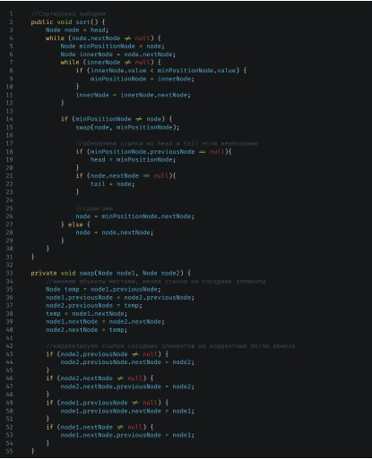

### Метод разворота связного списка (двухсвязного или односвязного на выбор).

Для связного списка также существуют специфические задачи – например,\
разворот. Разворотом называется операция, когда последний элемент становится\
первым, предпоследний вторым и т.д.

Когда речь идет про алгоритмы разворота, то оценивать сложность с точки зрения\
количества операций смысла не имеет – все равно тем или иным образом нам\
придется обратиться к каждому из элементов списка, а значит получить сложность\
O(n). А вот количество памяти, которое придется затратить будет иметь значение.\
Например, самый просто способ получить развернутый список (если мы говорим\
про двунаправленный список), это создать новый экземпляр и заполнить его,\
прочитав исходный список с конца. Но создание полностью нового экземпляра\
списка со всеми значениями потребует O(n) памяти, т.к. для каждого узла придется\
создать копию в новом объекте. Для больших объектов это может стать проблемой.\
Давайте разберем вариант, при котором расход памяти будет меньше, а именно\
O(1), что более оптимально.\
На самом деле нам не имеет смысл создавать новый список, если нам нужно\
развернуть существующий. Каждый узел списка всегда хранит в себе ссылки на\
соседние элементы, а значит их нужно просто поменять местами, что последний\
элемент стал первым. Проще всего это продемонстрировать на однонаправленном\
списке.

public void revert() {\
    Node node = head;

    меняем местами указатели на head и tail

    Node temp = head;
    head = tail;
    tail = temp;

    перебираем список, переворачивая указатели

    while (node.nextNode != null) {
        temp = node.nextNode;
        node.nextNode = node.previousNode;
        node.previousNode = temp;
        node = node.previousNode;
    }
}

Таким образом нам требуется только 1 дополнительная переменная в памяти для\
хранения значения во время замены элементов местами, что дает константную\
сложность O(1).

### Метод сортировки пузырьком для двухсвязного списка.

Сортировка связного списка имеет те же особенности, что и поиск по связному\
списку – большая часть алгоритмов основана на работе с индексами и для\
корректной реализации необходимо учитывать поведение поиска элементов и\
заменять его на работу с узлами. Например, сортировка пузырьком ничем от\
реализации для массива не отличается, т.к. всегда проверяются только соседние\
элементы, и они же меняются местами. Сортировка вставками ведет себя\
аналогично – процесс обмена элементами происходит по мере продвижения по\
списку. Сортировка выбором так же легко модифицируются под работу со списками\
– хранение нужного индекса заменяется на хранение ссылки на нужную ноду.

Несмотря на выросший объем кода, логика сортировки не изменилась, \
равно как и сложность – O(n2).\
Аналогично процедура пройдет и для алгоритма быстрой сортировки.

